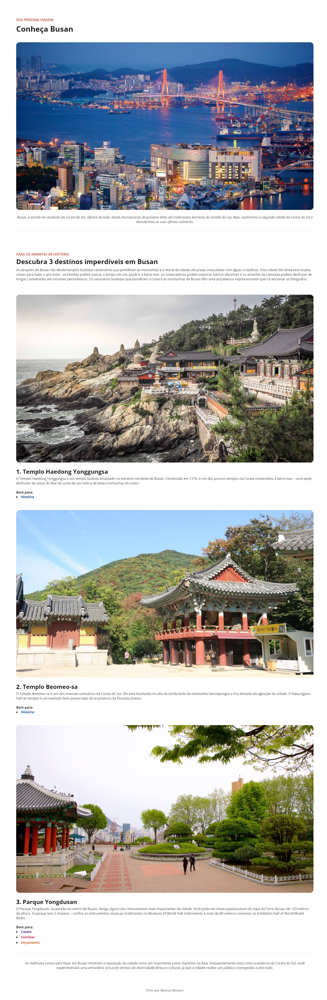

<h1 align="center">Desafio prático - Local Turístico</h1>

Projeto de consolidação de habilidades

## Tecnologias

Esse projeto foi desenvolvido com as seguintes tecnologias:

- HTML e CSS
- Figma

## Desafio prático - Local Turístico

- Desenvolver uma página web com informações sobre um determinado local turístico.